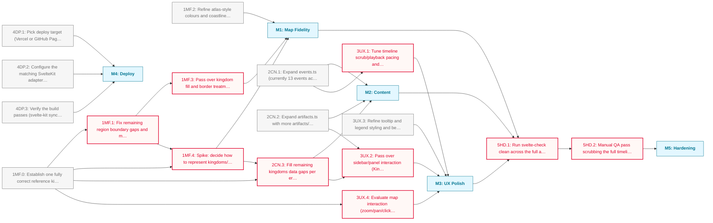

# Historia: Historia Foundation Roadmap

Establishes Historia's core: a real MapLibre-rendered map of Britain 300–1066 CE with region-accurate kingdom boundaries, a full complement of events and artefacts, polished interaction, and an early live deployment.

**Critical path:** `1MF.0 → 1MF.1 → 1MF.4 → 2CN.3 → 3UX.2 → M3 → 5HD.1 → 5HD.2`; the reference kingdom validates the whole region-to-kingdom pipeline before boundary fixes, the uncertain-borders spike, and remaining content can proceed with confidence.

---

## Milestone 1: Map Fidelity

**Goal:** Get the MapLibre renderer and region data to a trustworthy, good-looking baseline

- [ ] **1MF.0**: Establish one fully correct reference kingdom (regions dissolved correctly + complete data) to validate the region-to-kingdom pipeline end to end
- [ ] **1MF.1**: Fix remaining region boundary gaps and mismatches across the topology using the reference kingdom as the validated pattern _(blocked: depends on 1MF.0)_
- [ ] **1MF.2**: Refine atlas-style colours and coastline rendering for visual fidelity
- [ ] **1MF.3**: Pass over kingdom fill and border treatment once boundaries are correct _(blocked: depends on 1MF.1)_
- [ ] **1MF.4**: Spike: decide how to represent kingdoms/borders for periods where the historical record only supports incomplete or contested boundaries (e.g. fuzzy-edge styling, confidence bands, omission vs approximation) _(blocked: depends on 1MF.0, 1MF.1)_
  - Note: Research/design spike, not implementation; output is a decision the rest of M1/M2 border work can follow

---

## Milestone 2: Content

**Goal:** Bring events, artifacts and kingdoms data to a depth that matches the timeline's 766-year span

- [ ] **2CN.1**: Expand events.ts (currently 13 events across 300-1066 CE) with a fuller set of key historical events
- [ ] **2CN.2**: Expand artifacts.ts with more artifacts/sites across all four eras
- [ ] **2CN.3**: Fill remaining kingdoms data gaps per era using the reference kingdom's region-assignment pattern _(blocked: depends on 1MF.0, 1MF.4)_

---

## Milestone 3: UX Polish

**Goal:** Tune interaction and information density now that content and map fidelity have real data to design against

- [ ] **3UX.1**: Tune timeline scrub/playback pacing and smoothness against the expanded event set _(blocked: depends on 2CN.1)_
- [ ] **3UX.2**: Pass over sidebar/panel interaction (KingdomPanel, ArtifactPanel, lists) against realistic data density _(blocked: depends on 2CN.2, 2CN.3)_
- [ ] **3UX.3**: Refine tooltip and legend styling and behaviour
- [ ] **3UX.4**: Evaluate map interaction (zoom/pan/click/hover/period transitions) against the reference kingdom's real region geometry _(blocked: depends on 1MF.0)_

---

## Milestone 4: Deploy

**Goal:** Get a live, shareable URL up early, independent of content completeness

- [ ] **4DP.1**: Pick deploy target (Vercel or GitHub Pages) and confirm it suits SvelteKit + static topology data
- [ ] **4DP.2**: Configure the matching SvelteKit adapter for the chosen target
- [ ] **4DP.3**: Verify the build passes (svelte-kit sync + svelte-check clean), then deploy and confirm the live URL renders the map

---

## Milestone 5: Hardening

**Goal:** Confirm the phase's work holds together before calling Historia Foundation done

- [ ] **5HD.1**: Run svelte-check clean across the full app once M1-M3 have landed _(blocked: depends on M1, M2, M3)_
- [ ] **5HD.2**: Manual QA pass scrubbing the full timeline across all four eras, checking map, panels and data consistency _(blocked: depends on 5HD.1)_

---

## Dependency Diagram

